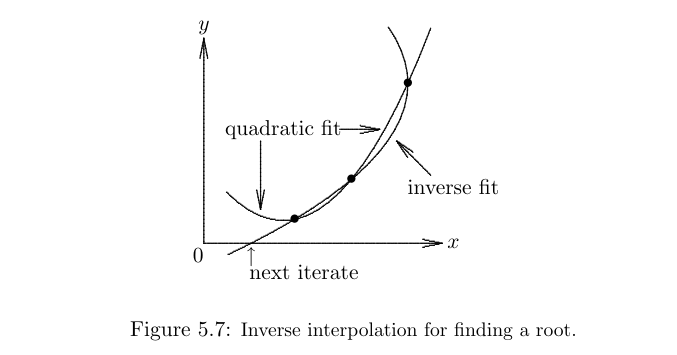
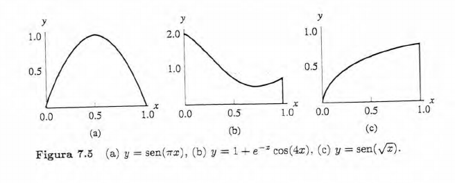

## Heath. Scientific Computing
### Chapter 7. Interpolation

**7.1** Interpolación Polinomial: Tres Bases para los Puntos $(-1,1)$, $(0,0)$, $(1,1)$

Se desea encontrar el polinomio $p(x)$ de grado $\leq 2$ que pasa por los tres puntos:

$$(-1,\,1),\quad (0,\,0),\quad (1,\,1)$$

---

#### (a) Base Monomial

Se propone $p(x) = a_0 + a_1 x + a_2 x^2$ y se imponen las condiciones de interpolación:

$$p(-1) = a_0 - a_1 + a_2 = 1$$
$$p(0)  = a_0              = 0$$
$$p(1)  = a_0 + a_1 + a_2 = 1$$

De la segunda ecuación: $a_0 = 0$. Sustituyendo en las otras dos:

$$-a_1 + a_2 = 1$$
$$ a_1 + a_2 = 1$$

Sumando ambas: $2a_2 = 2 \Rightarrow a_2 = 1$. Restando: $2a_1 = 0 \Rightarrow a_1 = 0$.

$$\boxed{p(x) = x^2}$$

---

#### (b) Base de Lagrange

Los polinomios de base de Lagrange para los nodos $x_0=-1$, $x_1=0$, $x_2=1$ son:

$$L_0(x) = \frac{(x - x_1)(x - x_2)}{(x_0 - x_1)(x_0 - x_2)}
           = \frac{(x-0)(x-1)}{(-1-0)(-1-1)}
           = \frac{x(x-1)}{2}$$

$$L_1(x) = \frac{(x - x_0)(x - x_2)}{(x_1 - x_0)(x_1 - x_2)}
           = \frac{(x+1)(x-1)}{(1)(-1)}
           = -(x^2 - 1) = 1 - x^2$$

$$L_2(x) = \frac{(x - x_0)(x - x_1)}{(x_2 - x_0)(x_2 - x_1)}
           = \frac{(x+1)(x-0)}{(2)(1)}
           = \frac{x(x+1)}{2}$$

El polinomio interpolador es:

$$p(x) = f_0\,L_0(x) + f_1\,L_1(x) + f_2\,L_2(x)
       = 1\cdot\frac{x(x-1)}{2} + 0\cdot(1-x^2) + 1\cdot\frac{x(x+1)}{2}$$

$$p(x) = \frac{x(x-1) + x(x+1)}{2} = \frac{x^2 - x + x^2 + x}{2} = \frac{2x^2}{2}$$

$$\boxed{p(x) = x^2}$$

---

#### (c) Base de Newton (Diferencias Divididas)

Se construye la tabla de diferencias divididas con $x_0=-1$, $x_1=0$, $x_2=1$:

| $x_i$ | $f[\cdot]$ | $f[\cdot,\cdot]$ | $f[\cdot,\cdot,\cdot]$ |
|:------:|:----------:|:----------------:|:----------------------:|
| $-1$   | $1$        |                  |                        |
|        |            | $\dfrac{0-1}{0-(-1)} = -1$ |               |
| $0$    | $0$        |                  | $\dfrac{1-(-1)}{1-(-1)} = 1$ |
|        |            | $\dfrac{1-0}{1-0} = 1$    |                |
| $1$    | $1$        |                  |                        |

Los coeficientes de Newton son:
$$c_0 = f[x_0] = 1, \qquad c_1 = f[x_0,x_1] = -1, \qquad c_2 = f[x_0,x_1,x_2] = 1$$

El polinomio en forma de Newton es:

$$p(x) = c_0 + c_1(x - x_0) + c_2(x - x_0)(x - x_1)$$

$$p(x) = 1 + (-1)(x + 1) + 1\cdot(x+1)(x - 0)$$

$$p(x) = 1 - x - 1 + x(x+1) = -x + x^2 + x$$

$$\boxed{p(x) = x^2}$$

---

#### Conclusión

Las tres representaciones producen exactamente el mismo polinomio:

$$p(x) = x^2$$

Esto es consistente con el **Teorema de unicidad del polinomio interpolador**: dado un conjunto de $n+1$ nodos distintos, existe un **único** polinomio de grado $\leq n$ que los interpola. Las bases monomial, de Lagrange y de Newton son distintas representaciones del mismo objeto matemático.

**7.2**  Exprese el siguiente polinomio en la forma correcta para su evaluación mediante el método de Horner: 
$$p(t) = 5t^3 - 3t^2 + 7t - 2.$$

**Idea del método**

El método de Horner (o evaluación anidada) reescribe el polinomio factorizando sucesivamente $t$ de adentro hacia afuera, minimizando el número de operaciones aritméticas. Para un polinomio de grado $n$:

$$p(t) = a_n t^n + a_{n-1}t^{n-1} + \cdots + a_1 t + a_0$$

la forma anidada es:

$$p(t) = (\cdots((a_n\, t + a_{n-1})\,t + a_{n-2})\,t + \cdots + a_1)\,t + a_0$$

---

**Desarrollo para $p(t) = 5t^3 - 3t^2 + 7t - 2$**

Los coeficientes en orden descendente son $a_3=5,\ a_2=-3,\ a_1=7,\ a_0=-2$.

**Paso 1.** Se parte del coeficiente líder:

$$5$$

**Paso 2.** Se multiplica por $t$ y se suma $a_2 = -3$:

$$5t + (-3) = 5t - 3$$

**Paso 3.** Se multiplica por $t$ y se suma $a_1 = 7$:

$$(5t - 3)\,t + 7 = 5t^2 - 3t + 7$$

**Paso 4.** Se multiplica por $t$ y se suma $a_0 = -2$:

$$(5t^2 - 3t + 7)\,t + (-2) = 5t^3 - 3t^2 + 7t - 2 \checkmark$$

---

**Forma anidada final**

$$\boxed{p(t) = \bigl((5\,t - 3)\,t + 7\bigr)\,t - 2}$$

---

**Ejemplo numérico: evaluación en $t = 2$**

| Paso | Operación                     | Resultado |
|:----:|:------------------------------|:---------:|
| 1    | $b_3 = 5$                     | $5$       |
| 2    | $b_2 = 5 \times 2 + (-3)$     | $7$       |
| 3    | $b_1 = 7 \times 2 + 7$        | $21$      |
| 4    | $b_0 = 21 \times 2 + (-2)$    | $40$      |

$$p(2) = 5(8) - 3(4) + 7(2) - 2 = 40 - 12 + 14 - 2 = 40 \checkmark$$

---

**Ventaja computacional**

| Método          | Multiplicaciones | Sumas/Restas |
|:----------------|:----------------:|:------------:|
| Directo         | $6$              | $3$          |
| **Horner**      | **$3$**          | **$3$**      |

En general, para grado $n$, Horner requiere exactamente $n$ multiplicaciones
y $n$ sumas, frente a las $\tfrac{n(n+1)}{2}$ multiplicaciones del método directo.

**7.3** Escriba un algoritmo formal para evaluar un polinomio en un argumento dado utilizando el esquema de evaluación anidada de Horner.

_(a)_ Para un polinomio expresado en términos de la base monomial.

Dado el polinomio de grado $n$ en base monomial:

$$p(t) = a_n t^n + a_{n-1}t^{n-1} + \cdots + a_1 t + a_0 = \sum_{k=0}^{n} a_k\, t^k$$

y un argumento $t = x$, evaluar $p(x)$ de forma eficiente.

**Forma anidada**

$$p(x) = (\cdots((a_n\, x + a_{n-1})\,x + a_{n-2})\,x + \cdots + a_1)\,x + a_0$$

#### Algoritmo

**Entrada:** coeficientes $a_0, a_1, \ldots, a_n \in \mathbb{R}$; punto de evaluación $x \in \mathbb{R}$  
**Salida:** $p(x)$

---
```
ALGORITMO Horner_Monomial(a[0..n], x):

    b ← a[n]                        // inicializar con el coeficiente líder

    PARA k = n-1 HASTA 0 (paso -1):
        b ← b * x + a[k]            // acumulación anidada

    RETORNAR b
```

---

#### Traza para $p(t) = 5t^3 - 3t^2 + 7t - 2$, $\;x = 2$

Coeficientes en orden descendente: $a_3=5,\; a_2=-3,\; a_1=7,\; a_0=-2$.

| Iteración $k$ | Operación                  | $b$  |
|:-------------:|:---------------------------|:----:|
| inicio        | $b \leftarrow a_3 = 5$     | $5$  |
| $k=2$         | $b \leftarrow 5\cdot2+(-3)$| $7$  |
| $k=1$         | $b \leftarrow 7\cdot2+7$   | $21$ |
| $k=0$         | $b \leftarrow 21\cdot2+(-2)$| $40$|

$$p(2) = 40 \checkmark$$

---

_(b)_ Para un polinomio expresado en forma de Newton.

Dado el polinomio de grado $n$ en base de Newton con nodos $x_0, x_1, \ldots, x_{n-1}$:

$$p(t) = c_0 + c_1(t-x_0) + c_2(t-x_0)(t-x_1) + \cdots + c_n\prod_{k=0}^{n-1}(t - x_k)$$

donde $c_k = f[x_0, x_1, \ldots, x_k]$ son las diferencias divididas, evaluar $p(x)$.

#### Forma anidada

Factorizando desde el término más interno:

$$p(x) = c_0 + (x-x_0)\Bigl(c_1 + (x-x_1)\bigl(c_2 + \cdots + (x-x_{n-2})(c_{n-1} + c_n(x-x_{n-1}))\cdots\bigr)\Bigr)$$

#### Algoritmo

**Entrada:** coeficientes $c_0, c_1, \ldots, c_n \in \mathbb{R}$; nodos $x_0, x_1, \ldots, x_{n-1} \in \mathbb{R}$; punto de evaluación $x \in \mathbb{R}$  
**Salida:** $p(x)$

---
```
ALGORITMO Horner_Newton(c[0..n], x_nodos[0..n-1], x):

    b ← c[n]                              // inicializar con el último coeficiente

    PARA k = n-1 HASTA 0 (paso -1):
        b ← b * (x - x_nodos[k]) + c[k]  // acumulación anidada con nodo k

    RETORNAR b
```

---

#### Traza para los puntos $(-1,1),(0,0),(1,1)$, $\;x = 2$

De la tabla de diferencias divididas (ver interpolación de Lagrange-Newton):
$$c_0 = 1,\quad c_1 = -1,\quad c_2 = 1, \qquad x_0=-1,\; x_1=0$$

| Iteración $k$ | Operación                              | $b$  |
|:-------------:|:---------------------------------------|:----:|
| inicio        | $b \leftarrow c_2 = 1$                 | $1$  |
| $k=1$         | $b \leftarrow 1\cdot(2-0)+(-1)$        | $1$  |
| $k=0$         | $b \leftarrow 1\cdot(2-(-1))+1$        | $4$  |

$$p(2) = 4 = 2^2 \checkmark$$

---

### Comparación de ambos algoritmos

| Característica        | Base Monomial                     | Base de Newton                          |
|:----------------------|:----------------------------------|:----------------------------------------|
| **Coeficientes**      | $a_0, a_1, \ldots, a_n$           | $c_0, c_1, \ldots, c_n$ (dif. divididas)|
| **Nodos requeridos**  | Ninguno                           | $x_0, x_1, \ldots, x_{n-1}$            |
| **Recurrencia**       | $b \leftarrow b\cdot x + a_k$     | $b \leftarrow b\cdot(x-x_k) + c_k$     |
| **Multiplicaciones**  | $n$                               | $n$                                     |
| **Sumas/restas**      | $n$                               | $2n$ (incluye $x - x_k$)               |
| **Caso especial**     | Nodos equidistantes o ninguno     | Nodos arbitrarios                       |

> **Nota:** la base monomial es un caso particular de la base de Newton con
> $x_0 = x_1 = \cdots = x_{n-1} = 0$, en cuyo caso $x - x_k = x$ para
> todo $k$ y ambos algoritmos se reducen al mismo esquema.

**7.4** ¿Cuántas multiplicaciones se requieren para evaluar un polinomio $p(t)$ de grado $n-1$ en un punto dado $t = x$.

_(a)_ Representado en base monomial

$$p(t) = a_0 + a_1 t + a_2 t^2 + \cdots + a_{n-1}t^{n-1}$$

#### Método directo (ingenuo)

Cada potencia $t^k$ se calcula multiplicando $k$ veces, y luego se multiplica por $a_k$:

| Término       | Multiplicaciones para $t^k$ | Mult. por $a_k$ | Total del término |
|:-------------:|:---------------------------:|:---------------:|:-----------------:|
| $a_1 t$       | $0$                         | $1$             | $1$               |
| $a_2 t^2$     | $1$                         | $1$             | $2$               |
| $a_3 t^3$     | $2$                         | $1$             | $3$               |
| $\vdots$      | $\vdots$                    | $\vdots$        | $\vdots$          |
| $a_{n-1}t^{n-1}$ | $n-2$                    | $1$             | $n-1$             |

$$\text{Total} = 1 + 2 + \cdots + (n-1) = \frac{n(n-1)}{2} = O(n^2)$$

#### Método de Horner (evaluación anidada)

$$p(t) = a_0 + t\bigl(a_1 + t(a_2 + \cdots + t\,a_{n-1})\bigr)$$

En cada uno de los $n-1$ pasos se realiza exactamente **una** multiplicación por $t$:

$$\boxed{M_{\text{Monomial}}^{\text{Horner}} = n - 1 \text{ multiplicaciones}}$$

---

_(b)_ Representado en base de Lagrange

$$p(t) = \sum_{k=0}^{n-1} f_k\, L_k(t), \qquad L_k(t) = \prod_{\substack{j=0 \\ j\neq k}}^{n-1} \frac{t - t_j}{t_k - t_j}$$

#### Conteo para cada $L_k(t)$

Cada $L_k(t)$ es un producto de $n-1$ factores $\dfrac{t-t_j}{t_k - t_j}$ (con $j \neq k$).  
Los cocientes $\dfrac{1}{t_k - t_j}$ se precomputan, de modo que por cada factor se necesita:

- $1$ resta: $(t - t_j)$  
- $1$ multiplicación: por $\dfrac{1}{t_k-t_j}$ ya calculado  

Cada $L_k(t)$ requiere entonces $n-1$ multiplicaciones (para encadenar los $n-1$ factores). Además, multiplicar el resultado por $f_k$ cuesta $1$ multiplicación más.

| Operación                          | Costo por $k$  | Total ($n$ términos)        |
|:-----------------------------------|:--------------:|:---------------------------:|
| Producto de $n-1$ factores en $L_k$| $n-2$          | $n(n-2)$                    |
| Multiplicación $f_k \cdot L_k$     | $1$            | $n$                         |

$$\text{Total} = n(n-2) + n = n^2 - 2n + n = n(n-1)$$

$$\boxed{M_{\text{Lagrange}} = n(n-1) \text{ multiplicaciones} = O(n^2)}$$

> **Nota:** si los denominadores $t_k - t_j$ y los pesos $w_k = \prod_{j\neq k}(t_k-t_j)^{-1}$
> se precomputan (forma baricéntrica), el costo baja, pero sigue siendo $O(n)$
> por evaluación con $O(n^2)$ en el preprocesamiento.

---

_(c)_ Representado en base de Newton

$$p(t) = c_0 + c_1(t-t_0) + c_2(t-t_0)(t-t_1) + \cdots + c_{n-1}\prod_{k=0}^{n-2}(t-t_k)$$

#### Forma anidada de Horner

$$p(t) = c_0 + (t-t_0)\Bigl(c_1 + (t-t_1)\bigl(c_2 + \cdots + c_{n-2} + c_{n-1}(t - t_{n-2})\bigr)\Bigr)$$

En cada uno de los $n-1$ pasos se realiza exactamente **una** multiplicación por $(t - t_k)$:

$$\boxed{M_{\text{Newton}}^{\text{Horner}} = n-1 \text{ multiplicaciones}}$$

---

#### Resumen comparativo

| Base         | Método          | Multiplicaciones     | Orden    |
|:-------------|:----------------|:--------------------:|:--------:|
| Monomial     | Ingenuo         | $\dfrac{n(n-1)}{2}$ | $O(n^2)$ |
| **Monomial** | **Horner**      | $\mathbf{n-1}$       | $O(n)$   |
| Lagrange     | Estándar        | $n(n-1)$             | $O(n^2)$ |
| **Newton**   | **Horner**      | $\mathbf{n-1}$       | $O(n)$   |

#### Conclusión

Las bases **monomial** y **de Newton** evaluadas con el esquema de Horner
son igualmente óptimas: ambas requieren el **mínimo posible** de $n-1$
multiplicaciones para un polinomio de grado $n-1$.
La base de **Lagrange** en su forma estándar es cuadrática en operaciones,
lo que la hace computacionalmente menos eficiente para evaluación puntual.

---

**7.5**  En general, ¿es posible interpolar $n$ puntos de datos mediante un polinomio _cuadrático_ por partes, con nodos en los puntos de datos dados, de manera que el interpolante sea

_(a)_ ¿Continuamente diferenciable una vez?

_(b)_ ¿Continuamente diferenciable dos veces?

En cada caso, si la respuesta es "sí", explique por qué, y si la respuesta es "no", indique el valor máximo de _n_ para el cual _es_ posible.

Dados $n$ puntos de datos $(t_0, y_0), (t_1, y_1), \ldots, (t_{n-1}, y_{n-1})$, se construye un **spline cuadrático por partes** con nodos en los puntos dados: en cada subintervalo $[t_{i-1}, t_i]$ se define un polinomio cuadrático $q_i(t)$, para $i = 1, \ldots, n-1$.

### Conteo de grados de libertad

| Cantidad                          | Valor        |
|:----------------------------------|:------------:|
| Subintervalos                     | $n-1$        |
| Coeficientes por pieza (grado 2)  | $3$          |
| **Total de incógnitas**           | $3(n-1)$     |

### Condiciones de interpolación

Cada pieza debe pasar por sus dos nodos extremos:
$$q_i(t_{i-1}) = y_{i-1}, \quad q_i(t_i) = y_i, \qquad i = 1, \ldots, n-1$$

Esto impone $2(n-1)$ condiciones, que además garantizan automáticamente la
continuidad $C^0$ en los $n-2$ nodos interiores.

$$\text{Grados de libertad restantes} = 3(n-1) - 2(n-1) = \boxed{n-1}$$

---

#### (a) ¿Es posible exigir $C^1$?

Se requiere igualdad de derivadas primeras en cada uno de los $n-2$ nodos interiores
$t_1, t_2, \ldots, t_{n-2}$:

$$q_i'(t_i) = q_{i+1}'(t_i), \qquad i = 1, \ldots, n-2$$

Esto añade $n-2$ condiciones adicionales. El balance queda:

$$\underbrace{(n-1)}_{\text{g.d.l. disponibles}} - \underbrace{(n-2)}_{C^1 \text{ interior}} = 1 \geq 0$$

#### Respuesta: **Sí, siempre es posible.**

Para cualquier $n$, después de imponer interpolación y $C^1$, queda exactamente **1 grado de libertad libre** (por ejemplo, la derivada en el primer nodo $t_0$ puede elegirse libremente). El sistema es siempre compatible.

$$\text{G.d.l. libres tras } C^1 = 1 \quad \forall\, n$$

---

#### (b) ¿Es posible exigir $C^2$?

Sobre los mismos $n-2$ nodos interiores se añade la igualdad de derivadas segundas:

$$q_i''(t_i) = q_{i+1}''(t_i), \qquad i = 1, \ldots, n-2$$

Partiendo del único grado de libertad que quedaba tras $C^1$:

$$\underbrace{1}_{\text{g.d.l. tras }C^1} - \underbrace{(n-2)}_{C^2 \text{ interior}} = 3 - n$$

Para que el sistema sea compatible (no sobredeterminado) se necesita:

$$3 - n \geq 0 \implies n \leq 3$$

#### Respuesta: **No en general; el máximo es $n = 3$.**

| $n$ | G.d.l. tras $C^2$ | Situación                             |
|:---:|:-----------------:|:--------------------------------------|
| $2$ | $1$               | Trivial: 1 pieza, siempre $C^\infty$  |
| $3$ | $0$               | Posible y **único**: $C^2$ exacto     |
| $4$ | $-1$              | Sistema sobredeterminado, imposible   |
| $n > 3$ | $3-n < 0$   | Imposible en general                  |

Para $n = 3$ (dos piezas cuadráticas, un nodo interior), la condición $C^2$
consume el último grado de libertad y determina el spline de forma **única**.
Para $n \geq 4$, hay más condiciones de suavidad que incógnitas disponibles,
por lo que no existe tal interpolante en general.

---

#### Resumen

| Condición | ¿Posible para todo $n$? | G.d.l. libres | $n$ máximo si no |
|:---------:|:----------------------:|:-------------:|:----------------:|
| $C^1$     | **Sí**                 | $1$           | —                |
| $C^2$     | **No**                 | $3-n$         | $n \leq 3$       |

> **Conclusión:** la suavidad $C^1$ es siempre alcanzable con splines cuadráticos
> por partes. Para $C^2$ se requiere al menos polinomios **cúbicos** por partes
> (splines cúbicos), que son la herramienta estándar para interpolación suave
> con $n$ puntos arbitrarios.

**7.6** Suponiendo que $t_1, t_2, ..., t_n$ son distintos, demuestre que la matriz de Vandermonde **A** dada por $a_{ij} = t_i^{j-1}$ es no singular.

#### Definición de la matriz

Dados $n$ nodos distintos $t_1, t_2, \ldots, t_n \in \mathbb{R}$, la **matriz de Vandermonde** $A \in \mathbb{R}^{n \times n}$ tiene entradas $a_{ij} = t_i^{j-1}$, es decir:

$$A = \begin{pmatrix}
1 & t_1 & t_1^2 & \cdots & t_1^{n-1} \\
1 & t_2 & t_2^2 & \cdots & t_2^{n-1} \\
1 & t_3 & t_3^2 & \cdots & t_3^{n-1} \\
\vdots & \vdots & \vdots & \ddots & \vdots \\
1 & t_n & t_n^2 & \cdots & t_n^{n-1}
\end{pmatrix}$$

**Objetivo:** demostrar que $\det(A) \neq 0$ siempre que los $t_i$ sean distintos.

---

#### Fórmula explícita del determinante

Se puede demostrar que:

$$\det(A) = \prod_{1 \leq i < j \leq n} (t_j - t_i)$$

es decir, el producto de todas las diferencias $(t_j - t_i)$ con $j > i$.

#### Demostración por inducción sobre $n$

**Caso base $n = 1$:**

$$A = (1), \qquad \det(A) = 1 = \prod_{\emptyset} = 1 \checkmark$$

**Caso base $n = 2$:**

$$\det\begin{pmatrix} 1 & t_1 \\ 1 & t_2 \end{pmatrix} = t_2 - t_1 = \prod_{1 \leq i < j \leq 2}(t_j - t_i) \checkmark$$

**Hipótesis inductiva:** supóngase que la fórmula vale para matrices de Vandermonde de tamaño $(n-1)\times(n-1)$.

**Paso inductivo:** se considera la matriz $A$ de tamaño $n \times n$.
Se interpreta $\det(A)$ como un polinomio en $t_n$:

$$p(t_n) = \det(A)$$

Observaciones clave:

1. $\det(A)$ es un polinomio de grado $n-1$ en $t_n$ (la última fila aporta
   potencias $1, t_n, \ldots, t_n^{n-1}$, y el coeficiente de $t_n^{n-1}$
   es el menor cofactor correspondiente, que es la Vandermonde de
   $t_1, \ldots, t_{n-1}$).

2. Para cada $k \in \{1, \ldots, n-1\}$, si $t_n = t_k$, las filas $k$ y $n$
   de $A$ son idénticas, por lo que:
$$p(t_k) = \det(A)\big|_{t_n = t_k} = 0$$

   Luego $t_1, t_2, \ldots, t_{n-1}$ son $n-1$ raíces de $p(t_n)$.

3. Como $p(t_n)$ tiene grado $n-1$ y exactamente $n-1$ raíces, se factoriza
   completamente:

$$p(t_n) = C \cdot (t_n - t_1)(t_n - t_2)\cdots(t_n - t_{n-1})$$

   donde $C$ es el coeficiente líder de $t_n^{n-1}$, que es precisamente la
   Vandermonde de $t_1, \ldots, t_{n-1}$:

$$C = \det(A_{n-1}) = \prod_{1 \leq i < j \leq n-1}(t_j - t_i) \quad
\text{(hipótesis inductiva)}$$

4. Sustituyendo:

$$\det(A) = \prod_{1 \leq i < j \leq n-1}(t_j - t_i) \cdot \prod_{k=1}^{n-1}(t_n - t_k)
           = \prod_{1 \leq i < j \leq n}(t_j - t_i)$$

Esto completa la inducción. $\blacksquare$

---

## Consecuencia: no singularidad

Dado que los nodos son **distintos**, se tiene $t_j \neq t_i$ para todo $i \neq j$,
de modo que cada factor $(t_j - t_i) \neq 0$. Por lo tanto:

$$\det(A) = \prod_{1 \leq i < j \leq n}(t_j - t_i) \neq 0$$

Una matriz cuadrada es no singular si y solo si su determinante es distinto de
cero, luego:

$$\boxed{A \text{ es no singular} \iff t_1, t_2, \ldots, t_n \text{ son distintos}}$$

---

**7.7** Compare el costo de formar una matriz de Vandermonde inductivamente, como en la Sección 7.2.1 con el costo utilizando exponenciación explícita.

---

**7.2.1 Evaluación de Polinomios**

Además del costo de determinar la función interpolante, el costo de evaluarla en un punto dado es un factor importante al elegir un método de interpolación. Cuando se representa en la base monomial, un polinomio

$p_{n-1}(t) = x_1 + x_2 t + \cdots + x_n t^{n-1}$

puede evaluarse de manera muy eficiente utilizando el *método de Horner*, también conocido como *evaluación anidada* o *división sintética*:

$p_{n-1}(t) = x_1 + t(x_2 + t(x_3 + t(\cdots (x_{n-1} + x_n t)\cdots)))$

lo cual requiere únicamente $n$ sumas y $n$ multiplicaciones. Por ejemplo,

$1 - 4t + 5t^2 - 2t^3 + 3t^4 = 1 + t(-4 + t(5 + t(-2 + 3t)))$.

El mismo principio se aplica al formar una matriz de Vandermonde:

$a_{i,j} = \phi_j(t_i) = t_i^{j-1} = t_i \phi_{j-1}(t_i) = t_i a_{i,j-1} \quad \text{para } j = 2, \ldots, n,$

lo cual es superior al uso de exponenciación explícita.

Otras manipulaciones del polinomio interpolante, como la diferenciación o la integración, también son relativamente sencillas con la representación en base monomial.

---

#### Costo de Formación de la Matriz de Vandermonde

**Definición del problema**

Se desea formar la matriz de Vandermonde $A \in \mathbb{R}^{n \times n}$ con entradas $a_{ij} = t_i^{j-1}$, para $i, j = 1, \ldots, n$.

---

#### Método 1: Exponenciación explícita

Cada entrada se calcula directamente como $a_{ij} = t_i^{j-1}$.

**Costo por entrada**

Calcular $t_i^{j-1}$ mediante multiplicaciones sucesivas requiere $j-2$
multiplicaciones para $j \geq 2$ (y $0$ para $j=1$, pues $t_i^0 = 1$).

**Costo total**

Sumando sobre todas las entradas de la matriz:

$$\sum_{i=1}^{n}\sum_{j=2}^{n}(j-2)
  = n \sum_{j=2}^{n}(j-2)
  = n \sum_{k=0}^{n-2} k
  = n \cdot \frac{(n-2)(n-1)}{2}$$

$$\boxed{M_{\text{explícita}} = \frac{n(n-1)(n-2)}{2} \text{ multiplicaciones}}$$

Adicionalmente, si no se reutilizan las potencias entre filas (distintos $t_i$),
este costo se repite íntegramente para cada fila.

---

#### Método 2: Recurrencia inductiva (Sección 7.2.1)

Se utiliza la relación:

$$a_{i,1} = 1, \qquad a_{i,j} = t_i \cdot a_{i,j-1}, \quad j = 2, \ldots, n$$

Es decir, cada nueva columna se obtiene multiplicando la columna anterior por
$t_i$, exactamente como el esquema de Horner.

**Costo por fila**

Para la fila $i$ se realizan $n-1$ multiplicaciones (una por cada paso
$j = 2, 3, \ldots, n$).

**Costo total**

$$\boxed{M_{\text{inductiva}} = n(n-1) \text{ multiplicaciones}}$$

---

## Comparación directa

| Método             | Multiplicaciones           | Orden    |
|:-------------------|:--------------------------:|:--------:|
| Exponenciación     | $\dfrac{n(n-1)(n-2)}{2}$  | $O(n^3)$ |
| **Inductivo**      | $n(n-1)$                   | $O(n^2)$ |
| **Factor de mejora** | $\dfrac{n-2}{2}$         | $O(n)$   |

La recurrencia es un factor $\dfrac{n-2}{2}$ veces más barata: la mejora
**crece linealmente** con $n$.

#### Ejemplo numérico para $n = 10$

$$M_{\text{explícita}} = \frac{10 \cdot 9 \cdot 8}{2} = 360 \text{ mult.}$$

$$M_{\text{inductiva}} = 10 \cdot 9 = 90 \text{ mult.}$$

$$\text{Factor de mejora} = \frac{360}{90} = 4 = \frac{n-2}{2} = \frac{8}{2} \checkmark$$

---

#### ¿Por qué la recurrencia es más eficiente?

La exponenciación explícita **recalcula desde cero** cada potencia $t_i^{j-1}$,
ignorando que $t_i^{j-1} = t_i \cdot t_i^{j-2}$ ya fue computado en el paso
anterior. La recurrencia inductiva **reutiliza** cada resultado previo:

$$a_{i,j} = t_i \cdot \underbrace{a_{i,j-1}}_{\text{ya calculado}},$$

reduciendo el trabajo de $j-2$ multiplicaciones por entrada a exactamente
**una sola multiplicación** por entrada. Es el mismo principio del esquema de
Horner aplicado a la construcción de las potencias.

---

#### Resumen

$$\frac{M_{\text{explícita}}}{M_{\text{inductiva}}}
  = \frac{\,\tfrac{n(n-1)(n-2)}{2}\,}{n(n-1)}
  = \frac{n-2}{2} \xrightarrow{n \to \infty} \infty$$

El método inductivo es **asintóticamente superior**: pasa de $O(n^3)$ a $O(n^2)$,
una reducción completa de un orden de magnitud en la complejidad computacional,
simplemente explotando la estructura multiplicativa de las potencias.

**7.8** Utilice la interpolación de Lagrange para derivar la fórmulas dadas en la Sección 5.2.5 para inversa interpolación cuadrática.

---

**5.2.5 Interpolación Inversa**

En cada iteración del método de la secante, se ajusta una línea recta a dos valores de la función cuyo cero se busca. Se puede obtener una mayor tasa de convergencia (pero no superior a $r = 2$) ajustando un polinomio de mayor grado al número apropiado de valores de la función. Por ejemplo, se podría ajustar un polinomio cuadrático a tres iteraciones sucesivas y usar una de sus raíces como la siguiente solución aproximada. Sin embargo, existen varias dificultades con esta idea: el polinomio puede no tener raíces reales, e incluso si las tiene, pueden no ser fáciles de calcular, y puede no ser sencillo elegir cuál raíz usar como la siguiente iteración. (Por otro lado, si se busca una raíz compleja, entonces es deseable un polinomio con raíces complejas; en el método de Müller, por ejemplo, se utiliza un polinomio cuadrático para aproximar raíces complejas).

Una respuesta a estas dificultades se proporciona mediante la interpolación inversa, en la cual se ajustan los valores $x_k$ como función de los valores $y_k = f(x_k)$, por ejemplo, mediante un polinomio $p(y)$, de modo que la siguiente solución aproximada sea simplemente $p(0)$. Esta idea se ilustra en la Fig. 5.7, donde una parábola que ajusta $y$ como función de $x$ no tiene raíz real (es decir, no cruza el eje $x$), pero una parábola que ajusta $x$ como función de $y$ simplemente se evalúa en cero para obtener la siguiente iteración.



Utilizando la interpolación cuadrática inversa, en cada iteración se tienen tres valores aproximados de la solución, que denotamos por $a$, $b$ y $c$, con los valores correspondientes de la función $f_a$, $f_b$ y $f_c$, respectivamente. La siguiente solución aproximada se encuentra ajustando un polinomio cuadrático a $a$, $b$ y $c$ como una función de $f_a$, $f_b$, y $f_c$, y luego evaluando el polinomio en 0. Esta tarea se realiza mediante las siguientes fórmulas, cuya deducción se aclarará después de que estudiemos la interpolación de Lagrange en la Sección 7.2.2.

$$u = frac{f_b}{f_c}, v=frac{f_b}{f_a}, w=frac{f_a}{f_c}$$
$$p=v(w(u-w)(c-b)-(1-u)(b-a)), q=(w-1)(u-1)(v-1)$$

La interpolación fraccional lineal también es efectiva como un método general para encontrar ceros en una dimensión, como ilustra el siguiente ejemplo. Su tasa de convergencia asintótica es la misma que la de la interpolación cuadrática (inversa o regular), $r \approx 1.839$. Una vez más, este resultado es local, y las iteraciones deben iniciarse lo suficientemente cerca de la solución para obtener convergencia.

**Ejemplo 5.10 Interpolación Fraccional Lineal.** Ilustramos la interpolación fraccional lineal encontrando nuevamente una raíz de la ecuación

$f(x) = x^2 - 4 \sin(x) = 0.$

Tomando $a = 1$, $b = 2$ y $c = 3$ como valores iniciales, la secuencia de iteraciones se muestra a continuación.

| $x$       | $f(x)$    | $h$        |
|----------|----------|------------|
| 1.000000 | -2.365884 |            |
| 2.000000 | 0.362810  |            |
| 3.000000 | 8.435520  |            |
| 1.906953 | -0.139647 | -1.093047  |
| 1.93335  | -0.002131 | 0.026398   |
| 1.933756 | 0.000013  | -0.000406  |
| 1.933754 | 0.000000  | -0.000003  |

---

#### Derivación de la Interpolación Cuadrática Inversa mediante Lagrange

**Configuración del problema**

Se tienen tres puntos aproximados $a, b, c$ con valores de función $f_a = f(a)$, $f_b = f(b)$, $f_c = f(c)$

En la **interpolación inversa** se trata $x$ como función de $y = f(x)$,
ajustando un polinomio cuadrático $p(y)$ a los tres pares de datos:

$$(f_a,\, a), \quad (f_b,\, b), \quad (f_c,\, c)$$

La siguiente iteración es simplemente $p(0)$, es decir, el valor de $x$
que correspondería a $f(x) = 0$.

---

#### Polinomio interpolador de Lagrange

Los polinomios base de Lagrange con nodos $f_a, f_b, f_c$ son:

$$L_a(y) = \frac{(y - f_b)(y - f_c)}{(f_a - f_b)(f_a - f_c)}$$

$$L_b(y) = \frac{(y - f_a)(y - f_c)}{(f_b - f_a)(f_b - f_c)}$$

$$L_c(y) = \frac{(y - f_a)(y - f_b)}{(f_c - f_a)(f_c - f_b)}$$

El polinomio interpolador es:

$$p(y) = a\, L_a(y) + b\, L_b(y) + c\, L_c(y)$$

---

#### Evaluación en $y = 0$

La siguiente iteración es $p(0)$. Evaluando cada base:

$$L_a(0) = \frac{(-f_b)(-f_c)}{(f_a - f_b)(f_a - f_c)}
          = \frac{f_b\, f_c}{(f_a - f_b)(f_a - f_c)}$$

$$L_b(0) = \frac{(-f_a)(-f_c)}{(f_b - f_a)(f_b - f_c)}
          = \frac{f_a\, f_c}{(f_b - f_a)(f_b - f_c)}$$

$$L_c(0) = \frac{(-f_a)(-f_b)}{(f_c - f_a)(f_c - f_b)}
          = \frac{f_a\, f_b}{(f_c - f_a)(f_c - f_b)}$$

Entonces:

$$p(0) = \frac{a\, f_b f_c}{(f_a-f_b)(f_a-f_c)}
       + \frac{b\, f_a f_c}{(f_b-f_a)(f_b-f_c)}
       + \frac{c\, f_a f_b}{(f_c-f_a)(f_c-f_b)}$$

---

#### Introducción de las variables auxiliares

Se definen las razones:

$$u = \frac{f_b}{f_c}, \qquad v = \frac{f_b}{f_a}, \qquad w = \frac{f_a}{f_c}$$

Nótese que $uv = \dfrac{f_b^2}{f_a f_c}$ y $vw = \dfrac{f_b}{f_c} = u$, con la
relación $w = u/v$.

#### Reescritura de los denominadores

Se factoriza $f_a$ de $(f_a - f_b)$, $f_c$ de $(f_a - f_c)$, etc.:

$$f_a - f_b = f_a(1 - v), \qquad
  f_a - f_c = f_c(w - 1), \qquad
  f_b - f_a = f_a(v - 1)$$

$$f_b - f_c = f_c(u - 1), \qquad
  f_c - f_a = f_c(1 - w), \qquad
  f_c - f_b = f_c(1 - u)$$

#### Reescritura de cada término

**Término $a$:**

$$\frac{a\, f_b f_c}{(f_a-f_b)(f_a-f_c)}
= \frac{a\, f_b f_c}{f_a(1-v)\cdot f_c(w-1)}
= \frac{a\, f_b}{f_a(1-v)(w-1)}
= \frac{a\, v}{(1-v)(w-1)}$$

**Término $b$:**

$$\frac{b\, f_a f_c}{(f_b-f_a)(f_b-f_c)}
= \frac{b\, f_a f_c}{f_a(v-1)\cdot f_c(u-1)}
= \frac{b}{(v-1)(u-1)}$$

**Término $c$:**

$$\frac{c\, f_a f_b}{(f_c-f_a)(f_c-f_b)}
= \frac{c\, f_a f_b}{f_c(1-w)\cdot f_c(1-u)}
= \frac{c\, w\, u}{(1-w)(1-u)}$$

Observando que $wu = \dfrac{f_a}{f_c}\cdot\dfrac{f_b}{f_c}$ y reagrupando
signos para unificar el denominador común:

$$q = (w-1)(u-1)(v-1)$$

se puede escribir $p(0) = \dfrac{\text{numerador}}{q}$ donde el numerador es:

$$p = v\bigl[w(u-w)(c-b) - (1-u)(b-a)\bigr]$$

---

**Fórmulas finales**

Reuniendo todo, la iteración de **interpolación cuadrática inversa** queda:

$$\boxed{u = \frac{f_b}{f_c}, \qquad v = \frac{f_b}{f_a}, \qquad w = \frac{f_a}{f_c}}$$

$$\boxed{p = v\bigl[w(u-w)(c-b)-(1-u)(b-a)\bigr], \qquad q = (w-1)(u-1)(v-1)}$$

$$\boxed{x_{\text{nuevo}} = p(0) = b - \frac{p}{q}}$$

---

**Interpretación geométrica**

| Interpolación estándar | Interpolación inversa |
|:-----------------------|:----------------------|
| Se ajusta $p(x) \approx f(x)$ | Se ajusta $p(y) \approx x(y)$ |
| Se resuelve $p(x) = 0$ (puede no tener raíces reales) | Se evalúa $p(0)$ (siempre definido) |
| Requiere resolver ecuación cuadrática | Solo requiere sustitución directa |

La formulación inversa **evita los problemas** de raíces complejas e indeterminación
en la elección de raíz, a costa de requerir que $f$ sea localmente inyectiva
(invertible) en la vecindad de la raíz buscada.

---

### Computing Problems

**7.1** _(a)_  Escriba una rutina que utilice la regla de Horner para evaluar un polinomio $p(t)$ dado su grado $\text{n}$, un array $x$ que contiene sus coeficientes, y el valor $\text{t}$ de la variable independiente en que debe ser evaluado.

_(b)_ Agregue opciones a su rutina para evaluar la derivada $p'(t)$ o la integral $\int_a^b p(t)dt$, dados $a$ y $b$.

**7.2** _(a)_  Escriba una rutina para calcular el Interpolante polinomial de Newton para un conjunto dado de puntos de datos, y una segunda rutina para evaluar el interpolante de Newton en un valor de argumento dado utilizando la regla de Horner.

_(b)_ Escriba una rutina para calcular el nuevo Interpolante polinomial de Newton cuando un se agrega un nuevo punto de datos.

_(c)_ Si su lenguaje de programación admite recursión,
escriba una rutina recursiva que implemente la parte _(a)_ llamando a su rutina para la parte _(b)_ recursivamente. Compare su rendimiento con la de su implementación original.

### Problema 7.3 (a)

Considere la interpolación spline cúbica natural para tres puntos de datos $(t_1, y_1)$, $(t_2, y_2)$ y $(t_3, y_3)$, usando dos polinomios:

$$
p_1(t) = \alpha_1 + \alpha_2 t + \alpha_3 t^2 + \alpha_4 t^3
$$

$$
p_2(t) = \beta_1 + \beta_2 t + \beta_3 t^2 + \beta_4 t^3
$$

El sistema de ecuaciones viene dado por:

**Interpolación:**
$$
\alpha_1 + \alpha_2 t_1 + \alpha_3 t_1^2 + \alpha_4 t_1^3 = y_1
$$
$$
\alpha_1 + \alpha_2 t_2 + \alpha_3 t_2^2 + \alpha_4 t_2^3 = y_2
$$
$$
\beta_1 + \beta_2 t_2 + \beta_3 t_2^2 + \beta_4 t_2^3 = y_2
$$
$$
\beta_1 + \beta_2 t_3 + \beta_3 t_3^2 + \beta_4 t_3^3 = y_3
$$

**Continuidad de la primera derivada en $t_2$:**
$$
\alpha_2 + 2\alpha_3 t_2 + 3\alpha_4 t_2^2 = \beta_2 + 2\beta_3 t_2 + 3\beta_4 t_2^2
$$

**Continuidad de la segunda derivada en $t_2$:**
$$
2\alpha_3 + 6\alpha_4 t_2 = 2\beta_3 + 6\beta_4 t_2
$$

**Condiciones de spline natural:**
$$
2\alpha_3 + 6\alpha_4 t_1 = 0
$$
$$
2\beta_3 + 6\beta_4 t_3 = 0
$$


---

**Instrucción:**  
Escriba este sistema en forma matricial:
$$
A \mathbf{x} = \mathbf{b}
$$
donde
$$
\mathbf{x} = (\alpha_1, \alpha_2, \alpha_3, \alpha_4, \beta_1, \beta_2, \beta_3, \beta_4)^T
$$

**Solución 7.3 _(a)_**

## 7.3 (a) — Sistema en forma matricial

El vector de incógnitas es $[\alpha_1, \alpha_2, \alpha_3, \alpha_4, \beta_1, \beta_2, \beta_3, \beta_4]^T$ y el sistema $Ax = b$ queda:

$$\begin{bmatrix} 1 & t_1 & t_1^2 & t_1^3 & 0 & 0 & 0 & 0 \\ 1 & t_2 & t_2^2 & t_2^3 & 0 & 0 & 0 & 0 \\ 0 & 0 & 0 & 0 & 1 & t_2 & t_2^2 & t_2^3 \\ 0 & 0 & 0 & 0 & 1 & t_3 & t_3^2 & t_3^3 \\ 0 & 1 & 2t_2 & 3t_2^2 & 0 & -1 & -2t_2 & -3t_2^2 \\ 0 & 0 & 2 & 6t_2 & 0 & 0 & -2 & -6t_2 \\ 0 & 0 & 2 & 6t_1 & 0 & 0 & 0 & 0 \\ 0 & 0 & 0 & 0 & 0 & 0 & 2 & 6t_3 \end{bmatrix} \begin{bmatrix} \alpha_1 \\ \alpha_2 \\ \alpha_3 \\ \alpha_4 \\ \beta_1 \\ \beta_2 \\ \beta_3 \\ \beta_4 \end{bmatrix} = \begin{bmatrix} y_1 \\ y_2 \\ y_2 \\ y_3 \\ 0 \\ 0 \\ 0 \\ 0 \end{bmatrix}$$

_(b)_ Utilice una rutina de biblioteca o una propia.
diseño, para resolver el sistema lineal $8 x 8$ resultante utilizando los datos proporcionados en el Ejemplo 7.1.

**Ejemplo 7.1 Base monomial.** Para ilustrar la interpolación polinómica usando la base monomial, encontraremos un polinomio de grado dos que interpole los tres puntos de datos $(-2,-27)$, $(0,-1)$, $(1,0)$. En general, existe un único polinomio

$$p_2(t) = x_1 + x_2 t + x_3 t^2$$

de grado dos que interpola tres puntos $(t_1, y_1)$, $(t_2, y_2)$, $(t_3, y_3)$. Con la base monomial, los coeficientes del polinomio satisfacen el sistema de ecuaciones lineales

```math
\begin{bmatrix}
1 & t_1 & t_1^2 \\
1 & t_2 & t_2^2 \\
1 & t_3 & t_3^2
\end{bmatrix}
\begin{bmatrix} x_1 \\ x_2 \\ x_3 \end{bmatrix}
=
\begin{bmatrix} y_1 \\ y_2 \\ y_3 \end{bmatrix}
```

Para este conjunto particular de datos, el sistema se convierte en

```math
\begin{bmatrix}
1 & -2 & 4 \\
1 & 0 & 0 \\
1 & 1 & 1
\end{bmatrix}
\begin{bmatrix}
x_1 \\
x_2 \\
x_3
\end{bmatrix}
=
\begin{bmatrix}
-27 \\
-1 \\
0
\end{bmatrix}
```

Resolviendo este sistema por eliminación gaussiana se obtiene la solución $x = [-1 \ \ 5 \ \ -4]^T$, por lo que el polinomio interpolante es

$$p_2(t) = -1 + 5t - 4t^2.$$

**Nota**: Los valores son $(-2,-27)$, $(0,-1)$, $(1,0)$.

_(c)_ Grafique la spline cúbica natural resultante,
junto con los puntos de datos proporcionados. También grafique el primera y segunda derivadas de la spline cúbica y confirmar que se cumplen todas las condiciones requeridas se cumplen.

**7.4** Un experimento ha producido los siguientes datos:

| t   | 0.0 | 0.5 | 1.0 | 6.0 | 7.0 | 9.0 |
|-----|-----|-----|-----|-----|-----|-----|
| y   | 0.0 | 1.6 | 2.0 | 2.0 | 1.5 | 0.0 |

Deseamos interpolar los datos con una curva suave con la esperanza de obtener valores razonables de $y$ para valores de $t$ entre los puntos en qué medidas se tomaron.

_(a)_ Utilizando cualquier método que prefiera, determine el polinomio de grado cinco que interpola el
dados los datos, y hacer un gráfico suave de ellos sobre
el rango $0 ≤ t ≤ 9.$

_(b)_ De forma similar, determine una función spline cúbica que interpole los datos proporcionados y cree una gráfica suavizada de la misma en el mismo rango.

_(c)_ ¿Qué interpolador parece dar valores más razonables entre los puntos de datos dados? ¿Puedes explicar por qué cada curva se comporta de esa manera?

_(d)_ ¿Podría la interpolación lineal por tramos ser una mejor opción para estos datos en particular? ¿Por qué?

**7.5** Interpolación de los puntos de datos

| $t$ | 0 | 1 | 4 | 9 | 16 | 25 | 36 | 49 | 64 |
|-----|---|---|---|---|----|----|----|----|----|
| $y$ | 0 | 1 | 2 | 3 | 4  | 5  | 6  | 7  | 8  |

debería proporcionar una aproximación a la función de raíz cuadrada.

_(a)_ Calcule el polinomio de grado ocho que interpola estos nueve puntos de datos. Represente gráficamente el polinomio resultante, así como los valores correspondientes dados por la función sqrt integrada en el dominio $[0, 64]$.

_(b)_ Utilice una rutina de spline cúbico para interpolar los mismos datos y vuelva a graficar la curva resultante junto con la función _sqrt_ integrada.

_(c)_ ¿Cuál de los dos interpolantes es más preciso en la mayor parte del dominio?

_(d)_ ¿Cuál de los dos interpolantes es más preciso entre $0$ y $1$?

**7.6** La función gamma esta definida por


$$\Gamma(x) = \int_{0}^{\infty} t^{x-1} e^{-t} \, dt, \quad x > 0.$$

Para un argumento entero n, la función gamma tiene el valor

$$\Gamma(n) = (n - 1)!$$

por lo tanto, interpolando los puntos de datos

| $t$ | 1 | 2 | 3 | 4 | 5 |
|-----|---|---|---|---|---|
| $y$ | 1 | 1 | 2 | 6 | 24 |

debería proporcionar una aproximación a la función gamma
en el rango dado.

_(a)_ Calcule el polinomio de grado cuatro que interpola estos cinco puntos de datos. Represente gráficamente el polinomio resultante, así como los valores correspondientes dados por la función gamma incorporada en el dominio $[1, 5]$.

_(b)_ Utilice una rutina de spline cúbico para interpolar los mismos datos y vuelva a trazar la curva resultante junto con la función $\text{gamma}$ incorporada.

_(c)_ ¿Cuál de los dos interpolantes es más preciso en la mayor parte del dominio?

_(d)_ ¿Cuál de los dos interpolantes es más preciso entre $1$ y $2$?.

**7.7** Consideremos los siguientes datos demográficos de Estados Unidos:

| Year | Population  |
|------|-------------|
| 1900 | 76,212,168  |
| 1910 | 92,228,496  |
| 1920 | 106,021,537 |
| 1930 | 123,202,624 |
| 1940 | 132,164,569 |
| 1950 | 151,325,798 |
| 1960 | 179,323,175 |
| 1970 | 203,302,031 |
| 1980 | 226,542,199 |

Existe un único polinomio de grado ocho que interpola estos nueve puntos de datos, pero, por supuesto, ese polinomio puede representarse de muchas maneras diferentes. Consideremos los siguientes conjuntos posibles de funciones base $\phi_j(t)$, $j = 1, 2, ..., 9$:

1. $\phi_j(t)=t^{j-1}$
2. $\phi_j(t)=(t-1900)^{j-1}$
3. $\phi_j(t)=(t-1940)^{j-1}$
4. $\phi_j(t)=((t-1940)/40)^{j-1}$

_(a)_ Para cada uno de estos cuatro conjuntos de funciones base, genere la matriz de Vandermonde correspondiente y calcule su número de condición utilizando una rutina de biblioteca para la estimación de condiciones. ¿Cómo se comparan los números de condición? Explique sus resultados.

_(b)_ Utilizando la base mejor condicionada hallada en la parte $a$, calcule el polinomio interpolante para los datos de la población. Grafique el polinomio resultante, empleando el método de evaluación anidada de Horner para evaluarlo a intervalos de un año y obtener una curva suave. Grafique también los puntos de datos originales en el mismo gráfico.

_(c)_ Utilice una rutina de interpolación cúbica para interpolar los datos de la población y, a continuación, represente gráficamente la curva resultante en el mismo gráfico.

_(d)_ Utilice tanto el polinomio como la función spline para extrapolar la población a $1990$ y compare los valores obtenidos. ¿Qué tan cerca están estos valores del valor real de $248,709,873$ según el censo de $1990$?

_(e)_ Determine el interpolante de Lagrange para los mismos nueve puntos de datos y evalúelo en los mismos intervalos anuales que en las partes $\text{b}$ y $\text{c}$. Compare el tiempo total de ejecución con los del esquema de evaluación anidada de Horner y con los de la evaluación de la spline cúbica.

_(f)_ Determine la forma de Newton del polinomio que interpola los mismos nueve puntos de datos.

Ahora determine el polinomio de Newton de un grado superior que también interpola el punto de datos adicional de $1990$ dado en el apartado _d_, sin comenzar de cero (es decir, utilice el polinomio de Newton de grado ocho ya calculado para determinar el nuevo polinomio). Grafique ambos polinomios resultantes (de grado ocho y nueve) en el intervalo de $1900$ a $1990$.

_(g)_ Redondee los datos de población de cada año al millón más cercano y calcule el polinomio interpolante de grado ocho correspondiente, utilizando la misma base que en el apartado b. Compare los coeficientes resultantes con los determinados en el apartado b. Explique sus resultados.

---

### Métodos-Numéricos-con-Matlab-John-H-Mathews
#### Integración numérica

**1.** En los casos que se relacionan a continuación se considera la integración de la función dada $f(x)$ sobre el intervalo fijo $[a, b] = [0, 1]$. Aplique las fórmulas de cuadratura $(4) - (7)$

(4)  
$\int_{x_0}^{x_1} f(x)\,dx \approx \frac{h}{2}(f_0 + f_1)$  
(regla del trapecio)

(5)  
$\int_{x_0}^{x_2} f(x)\,dx \approx \frac{h}{3}(f_0 + 4f_1 + f_2)$  
(regla de Simpson)

(6)  
$\int_{x_0}^{x_3} f(x)\,dx \approx \frac{3h}{8}(f_0 + 3f_1 + 3f_2 + f_3)$  
(regla $3/8$ de Simpson)

(7)  
$\int_{x_0}^{x_4} f(x)\,dx \approx \frac{2h}{45}(7f_0 + 32f_1 + 12f_2 + 32f_3 + 7f_4)$  
(regla de Boole)

tomando como incremento: $h = \frac{1}{3}$ para la regla $\frac{3}{8}$ de Simpson y $h=\frac{1}{4}$ para la regla de Boole.

_(a)_ $f(x) = sen(\pi x)$

_(b)_ $f(x) = 1 + e^{-x}\cos(4x)$

_(c)_ $(x) = sen(\sqrt{x})$

**Observación.** Los valores exactos de las integrales definidas son:  

$(a)\; 2/\pi = 0.63661977237\ldots$,  

$(b)\; (18e - cos(4) + 4sen(4))/(17e) = 1.00745963140\ldots$  

$(c)\; 2(sen(1) - cos(1)) = 0.60233735788\ldots$.

Las gráficas de estas funciones se muestran en las Figuras $7.5(a)$, $(b)$ y $(c)$, respectivamente.

**2.** En los casos que se relacionan a continuación se considera la integración de la función dada $f(x)$ sobre el intervalo fijo $[a, b] = [0, 1]$. Aplique las siguientes fórmulas de cuadratura: la regla compuesta del trapecio:

$$
\begin{aligned}
\int_{x_0}^{x_4} f(x)\;dx &= \int_{x_0}^{x_1} f(x)\;dx + \int_{x_1}^{x_2} f(x)\;dx + \int_{x_2}^{x_3} f(x)\;dx + \int_{x_3}^{x_4} f(x)\;dx \\
&\approx \frac{h}{2}(f_0 + f_1) + \frac{h}{2}(f_1 + f_2) + \frac{h}{2}(f_2 + f_3) + \frac{h}{2}(f_3 + f_4) \\
&= \frac{h}{2}(f_0 + 2f_1 + 2f_2 + 2f_3 + f_4)
\end{aligned}
$$

la regla compuesta de Simpson:

$$
\begin{aligned}
\int_{x_0}^{x_4} f(x)\;dx &= \int_{x_0}^{x_2} f(x)\;dx + \int_{x_2}^{x_4} f(x)\;dx \\
&\approx \frac{h}{3}(f_0 + 4f_1 + f_2) + \frac{h}{3}(f_2 + 4f_3 + f_4) \\
&= \frac{h}{3}(f_0 + 4f_1 + 2f_2 + 4f_3 + f_4)
\end{aligned}
$$

y la regla de Boole:

$$\int_{x_0}^{x_4} f(x)\,dx \approx \frac{2h}{45}(7f_0 + 32f_1 + 12f_2 + 32f_3 + 7f_4)$$

Utilice cinco evaluaciones de la función en nodos equiespaciados con incremento $h = \frac{1}{4}$.

$(a)\; f(x) = sen(\pi x)$

$(b)\; f(x) = 1 + e^{-x}cos(4x)$

$(c)\; f(x) = sen(\sqrt{x})$

**3.** Sea $[a, b]$ un intervalo cualquiera. Pruebe que la regla de Simpson proporciona resultados exactos para las funciones $f(x) = x^2$ y $f(x) = x^3$; es decir,

$$(a)\; \int_a^b x^2\,dx = \frac{b^3}{3} - \frac{a^3}{3}$$

$$(b)\; \int_a^b x^3\,dx = \frac{b^4}{4} - \frac{a^4}{4}$$

---

## 3. La regla de Simpson proporciona resultados exactos para f(x) = x² y f(x) = x³

La regla de Simpson con h = (b-a)/2 y nodos x0=a, x1=(a+b)/2, x2=b es:

$$\frac{h}{3}(f_0 + 4f_1 + f_2)$$

### (a) f(x) = x²

Con $f_0 = a^2$, $f_1 = \left(\frac{a+b}{2}\right)^2$, $f_2 = b^2$, $h = \frac{b-a}{2}$:

$$\text{Simpson} = \frac{b-a}{6}\left(a^2 + 4\cdot\frac{(a+b)^2}{4} + b^2\right) = \frac{b-a}{6}(a^2 + (a+b)^2 + b^2)$$

$$= \frac{b-a}{6}(2a^2 + 2ab + 2b^2) = \frac{b-a}{3}(a^2 + ab + b^2)$$

Valor exacto:

$$\int_a^b x^2\,dx = \frac{b^3 - a^3}{3} = \frac{(b-a)(b^2 + ab + a^2)}{3}$$

Ambos coinciden exactamente. $\checkmark$

### (b) f(x) = x³

Con $f_0 = a^3$, $f_1 = \left(\frac{a+b}{2}\right)^3$, $f_2 = b^3$, $h = \frac{b-a}{2}$:

$$\text{Simpson} = \frac{b-a}{6}\left(a^3 + \frac{(a+b)^3}{2} + b^3\right)$$

Expandiendo $(a+b)^3 = a^3 + 3a^2b + 3ab^2 + b^3$:

$$= \frac{b-a}{12}(3a^3 + 3a^2b + 3ab^2 + 3b^3) = \frac{b-a}{4}(a^2+b^2)(a+b)$$

Valor exacto:

$$\int_a^b x^3\,dx = \frac{b^4 - a^4}{4} = \frac{(b^2+a^2)(b+a)(b-a)}{4}$$

Ambos coinciden exactamente. $\checkmark$

**Conclusión:** la regla de Simpson integra exactamente polinomios de grado hasta 3, aunque usa solo 3 puntos (orden de exactitud 3).

---

**4.** Integrando el polinomio de interpolación de Lagrange

$$P_1(x) = f_0 \frac{x - x_1}{x_0 - x_1} + f_1 \frac{x - x_0}{x_1 - x_0}$$

en el intervalo $[x_0, x_1]$, deduzca la regla del trapecio.

**Deducción de la regla del trapecio**

Integrando el polinomio de interpolación de Lagrange $P_1(x)$ en $[x_0, x_1]$:

$$\int_{x_0}^{x_1} P_1(x)\,dx = \int_{x_0}^{x_1} \left[ f_0 \frac{x - x_1}{x_0 - x_1} + f_1 \frac{x - x_0}{x_1 - x_0} \right] dx$$

Con $h = x_1 - x_0$ se tiene $x_0 - x_1 = -h$ y $x_1 - x_0 = h$, entonces:

$$= \int_{x_0}^{x_1} \left[ -\frac{f_0}{h}(x - x_1) + \frac{f_1}{h}(x - x_0) \right] dx$$

Integrando término a término:

$$\int_{x_0}^{x_1} (x - x_1)\,dx = \left[\frac{(x-x_1)^2}{2}\right]_{x_0}^{x_1} = 0 - \frac{(x_0-x_1)^2}{2} = -\frac{h^2}{2}$$

$$\int_{x_0}^{x_1} (x - x_0)\,dx = \left[\frac{(x-x_0)^2}{2}\right]_{x_0}^{x_1} = \frac{(x_1-x_0)^2}{2} = \frac{h^2}{2}$$

Sustituyendo:

$$\int_{x_0}^{x_1} P_1(x)\,dx = -\frac{f_0}{h}\cdot\left(-\frac{h^2}{2}\right) + \frac{f_1}{h}\cdot\frac{h^2}{2} = \frac{h}{2}f_0 + \frac{h}{2}f_1$$

$$\boxed{\int_{x_0}^{x_1} f(x)\,dx \approx \frac{h}{2}(f_0 + f_1)}$$

que es precisamente la regla del trapecio. $\checkmark$

**5.** Determine el grado de precisión de la regla del trapecio. Para ello es suficiente con aplicar la regla en el intervalo $[0, 1]$ a las funciones $f(x) = 1, x, x^2$.

**Grado de precisión de la regla del trapecio**

El grado de precisión es el mayor grado $n$ tal que la regla integra 
exactamente todos los polinomios de grado $\leq n$.

Aplicamos la regla del trapecio en $[0,1]$ con $h = 1$, $x_0 = 0$, $x_1 = 1$:

$$\int_0^1 f(x)\,dx \approx \frac{h}{2}(f_0 + f_1) = \frac{1}{2}(f(0) + f(1))$$

### f(x) = 1

$$\text{Trapecio} = \frac{1}{2}(1 + 1) = 1$$

$$\text{Exacto} = \int_0^1 1\,dx = 1 \quad \checkmark$$

### f(x) = x

$$\text{Trapecio} = \frac{1}{2}(0 + 1) = \frac{1}{2}$$

$$\text{Exacto} = \int_0^1 x\,dx = \frac{1}{2} \quad \checkmark$$

### f(x) = x²

$$\text{Trapecio} = \frac{1}{2}(0 + 1) = \frac{1}{2}$$

$$\text{Exacto} = \int_0^1 x^2\,dx = \frac{1}{3} \quad \times$$

**Conclusión:** la regla del trapecio integra exactamente $f(x) = 1$ y 
$f(x) = x$, pero falla para $f(x) = x^2$. Por lo tanto su grado de 
precisión es $\mathbf{1}$.

**6.** Determine el grado de precisión de la regla de Simpson. Para ello es suficiente con aplicar la regla en el intervalo $[0, 2]$ a las cinco funciones $f(x) = 1,\, x,\, x^2,\, x^3\;y\; x^4$. Contraste su resultando con el grado de precisión de la regla $\frac{3}{8}$ de Simpson.



**Grado de precisión de la regla de Simpson**

Aplicamos la regla de Simpson en $[0,2]$ con $h = 1$, nodos $x_0=0$, $x_1=1$, $x_2=2$:

$$\frac{h}{3}(f_0 + 4f_1 + f_2) = \frac{1}{3}(f(0) + 4f(1) + f(2))$$

**f(x) = 1**
$$\text{Simpson} = \frac{1}{3}(1 + 4 + 1) = 2 \qquad \text{Exacto} = \int_0^2 1\,dx = 2 \quad \checkmark$$

**f(x) = x**
$$\text{Simpson} = \frac{1}{3}(0 + 4 + 2) = 2 \qquad \text{Exacto} = \int_0^2 x\,dx = 2 \quad \checkmark$$

**f(x) = x²**
$$\text{Simpson} = \frac{1}{3}(0 + 4 + 4) = \frac{8}{3} \qquad \text{Exacto} = \int_0^2 x^2\,dx = \frac{8}{3} \quad \checkmark$$

**f(x) = x³**
$$\text{Simpson} = \frac{1}{3}(0 + 4 + 8) = 4 \qquad \text{Exacto} = \int_0^2 x^3\,dx = 4 \quad \checkmark$$

**f(x) = x⁴**
$$\text{Simpson} = \frac{1}{3}(0 + 4 + 16) = \frac{20}{3} \qquad \text{Exacto} = \int_0^2 x^4\,dx = \frac{32}{5} \quad \times$$

**Conclusión:** la regla de Simpson integra exactamente hasta $x^3$ pero 
falla en $x^4$. Su grado de precisión es $\mathbf{3}$.

---

**Contraste con la regla 3/8 de Simpson**

Aplicamos la regla 3/8 en $[0,3]$ con $h = 1$, nodos $x_0=0$, $x_1=1$, $x_2=2$, $x_3=3$:

$$\frac{3h}{8}(f_0 + 3f_1 + 3f_2 + f_3) = \frac{3}{8}(f(0) + 3f(1) + 3f(2) + f(3))$$

**f(x) = x³**
$$\text{3/8} = \frac{3}{8}(0 + 3 + 24 + 27) = \frac{3}{8}(54) = \frac{81}{4} \qquad \text{Exacto} = \int_0^3 x^3\,dx = \frac{81}{4} \quad \checkmark$$

**f(x) = x⁴**
$$\text{3/8} = \frac{3}{8}(0 + 3 + 48 + 81) = \frac{3}{8}(132) = \frac{396}{8} = \frac{99}{2}$$

$$\text{Exacto} = \int_0^3 x^4\,dx = \frac{243}{5} \quad \times$$

**Conclusión:** la regla 3/8 de Simpson también integra exactamente hasta 
$x^3$ y falla en $x^4$. Su grado de precisión es igualmente $\mathbf{3}$.

Aunque ambas reglas usan distinto número de nodos (3 vs 4), comparten el 
mismo grado de precisión. La regla 3/8 no gana precisión respecto a 
Simpson estándar — su ventaja es práctica: permite subdividir intervalos 
en número de subintervalos múltiplo de 3.

**7.** Determine el grado de precisión de la regla de Boole. Para ello es suficiente con aplicar la regla en el intervalo $[0, 4]$ a las siete funciones $f(x) = 1,\, x,\, x^2,\, x^3,\, x^4,\, x^5\; y \; x^6$.

**Grado de precisión de la regla de Boole**

Aplicamos la regla de Boole en $[0,4]$ con $h = 1$, nodos $x_0=0$, $x_1=1$, $x_2=2$, $x_3=3$, $x_4=4$:

$$\frac{2h}{45}(7f_0 + 32f_1 + 12f_2 + 32f_3 + 7f_4) = \frac{2}{45}(7f(0) + 32f(1) + 12f(2) + 32f(3) + 7f(4))$$

**f(x) = 1**
$$\text{Boole} = \frac{2}{45}(7 + 32 + 12 + 32 + 7) = \frac{2}{45}(90) = 4 \qquad \text{Exacto} = \int_0^4 1\,dx = 4 \quad \checkmark$$

**f(x) = x**
$$\text{Boole} = \frac{2}{45}(0 + 32 + 24 + 96 + 28) = \frac{2}{45}(180) = 8 \qquad \text{Exacto} = \int_0^4 x\,dx = 8 \quad \checkmark$$

**f(x) = x²**
$$\text{Boole} = \frac{2}{45}(0 + 32 + 48 + 288 + 112) = \frac{2}{45}(480) = \frac{64}{3} \qquad \text{Exacto} = \int_0^4 x^2\,dx = \frac{64}{3} \quad \checkmark$$

**f(x) = x³**
$$\text{Boole} = \frac{2}{45}(0 + 32 + 96 + 864 + 448) = \frac{2}{45}(1440) = 64 \qquad \text{Exacto} = \int_0^4 x^3\,dx = 64 \quad \checkmark$$

**f(x) = x⁴**
$$\text{Boole} = \frac{2}{45}(0 + 32 + 192 + 2592 + 1792) = \frac{2}{45}(4608) = \frac{1024}{5}$$

$$\text{Exacto} = \int_0^4 x^4\,dx = \frac{1024}{5} \quad \checkmark$$

**f(x) = x⁵**
$$\text{Boole} = \frac{2}{45}(0 + 32 + 384 + 7776 + 7168) = \frac{2}{45}(15360) = \frac{2048}{3}$$

$$\text{Exacto} = \int_0^4 x^5\,dx = \frac{4096}{6} = \frac{2048}{3} \quad \checkmark$$

**f(x) = x⁶**
$$\text{Boole} = \frac{2}{45}(0 + 32 + 768 + 23328 + 28672) = \frac{2}{45}(52800) = \frac{7040}{3}$$

$$\text{Exacto} = \int_0^4 x^6\,dx = \frac{4^7}{7} = \frac{16384}{7} \quad \times$$

**Conclusión:** la regla de Boole integra exactamente hasta $x^5$ pero 
falla en $x^6$. Su grado de precisión es $\mathbf{5}$.

Esto es consistente con el patrón general: una regla de cuadratura con 
$n+1$ nodos tiene grado de precisión al menos $n$, y las reglas de Newton-Cotes 
con número par de subintervalos ganan un grado adicional. Boole usa 4 
subintervalos (5 nodos), por lo que su grado de precisión es $4+1 = 5$.

**8.** Los intervalos de los Ejercicios 5, 6 y 7 fueron elegidos para que el cálculo de los nodos de integración fuera sencillo. No obstante, sea cual sea el intervalo de integración $[a,b]$ en el que queramos integrar la función $f$, cada una de las cuatro fórmulas de cuadratura $(4)–(7)$ tiene el grado de precisión determinado en los Ejercicios $5, 6\; y\; 7$, respectivamente. Una fórmula de cuadratura en un intervalo $[a,b]$ puede obtenerse a partir de una fórmula de cuadratura en un intervalo $[c,d]$ haciendo el cambio de variables dado por la función lineal

$$x = g(t) = \frac{b-a}{d-c}t + \frac{ad - bc}{d-c}$$

tomando $dx = \frac{b-a}{d-c} dt$.

_(a)_ Compruebe que $x = g(t)$ es la línea recta que pasa por los puntos $(c,a)$ y $(d,b)$.

**Cambio de variables y grado de precisión en intervalo general [a,b]**

La función lineal de cambio de variables es:

$$x = g(t) = \frac{b-a}{d-c}t + \frac{ad-bc}{d-c}, \qquad dx = \frac{b-a}{d-c}\,dt$$

**g(t) pasa por los puntos (c,a) y (d,b)**

Evaluando en $t = c$:
$$g(c) = \frac{b-a}{d-c}c + \frac{ad-bc}{d-c} = \frac{(b-a)c + ad - bc}{d-c} = \frac{bc - ac + ad - bc}{d-c} = \frac{a(d-c)}{d-c} = a \quad \checkmark$$

Evaluando en $t = d$:
$$g(d) = \frac{b-a}{d-c}d + \frac{ad-bc}{d-c} = \frac{(b-a)d + ad - bc}{d-c} = \frac{bd - ad + ad - bc}{d-c} = \frac{b(d-c)}{d-c} = b \quad \checkmark$$

_(b)_ Compruebe que la regla del trapecio tiene el mismo grado de precisión en cualquier intervalo $[a,b]$ que en el intervalo $[0,1]$.

**Regla del trapecio en [a,b]**

Aplicando el cambio de variables con $[c,d] = [0,1]$, $g(t) = (b-a)t + a$:

$$\int_a^b f(x)\,dx = \int_0^1 f(g(t))(b-a)\,dt$$

Aplicando la regla del trapecio en $[0,1]$:

$$\approx (b-a)\cdot\frac{1}{2}(f(g(0)) + f(g(1))) = \frac{b-a}{2}(f(a) + f(b))$$

Para $f(x) = x^2$, el error en $[0,1]$ fue $\frac{1}{2} - \frac{1}{3} \neq 0$.
Bajo el cambio $x = (b-a)t + a$, $f(g(t)) = ((b-a)t+a)^2$ sigue siendo 
un polinomio de grado 2 en $t$, por lo que la regla del trapecio también 
falla para $x^2$ en cualquier $[a,b]$.

El grado de precisión es $\mathbf{1}$ en cualquier intervalo $[a,b]$. $\checkmark$

---

_(c)_ Compruebe que la regla de Simpson tiene el mismo grado de precisión en cualquier intervalo $[a,b]$ que en el intervalo $[0,2]$.

**Regla de Simpson en [a,b]**

Aplicando el cambio de variables con $[c,d] = [0,2]$, $g(t) = \frac{b-a}{2}t + a$:

$$\int_a^b f(x)\,dx = \int_0^2 f(g(t))\frac{b-a}{2}\,dt$$

Aplicando Simpson en $[0,2]$ con $h=1$:

$$\approx \frac{b-a}{2}\cdot\frac{1}{3}(f(g(0)) + 4f(g(1)) + f(g(2))) = \frac{b-a}{6}\left(f(a) + 4f\!\left(\frac{a+b}{2}\right) + f(b)\right)$$

Bajo el cambio $x = \frac{b-a}{2}t + a$, cualquier polinomio $f(x) = x^k$ 
se transforma en un polinomio de grado $k$ en $t$. Como Simpson integra 
exactamente hasta grado 3 en $[0,2]$, también integra exactamente hasta 
grado 3 en cualquier $[a,b]$.

El grado de precisión es $\mathbf{3}$ en cualquier intervalo $[a,b]$. $\checkmark$

---

_(d)_ Compruebe que la regla de Boole tiene el mismo grado de precisión en cualquier intervalo $[a,b]$ que en el intervalo $[0,4]$.

**Regla de Boole en [a,b]**

Aplicando el cambio de variables con $[c,d] = [0,4]$, $g(t) = \frac{b-a}{4}t + a$:

$$\int_a^b f(x)\,dx = \int_0^4 f(g(t))\frac{b-a}{4}\,dt$$

Aplicando Boole en $[0,4]$ con $h=1$:

$$\approx \frac{b-a}{4}\cdot\frac{2}{45}\left(7f(g(0)) + 32f(g(1)) + 12f(g(2)) + 32f(g(3)) + 7f(g(4))\right)$$

$$= \frac{b-a}{90}\left(7f(a) + 32f\!\left(\frac{a+3b}{4}\right) + 12f\!\left(\frac{a+b}{2}\right) + 32f\!\left(\frac{3a+b}{4}\right) + 7f(b)\right)$$

Bajo el cambio lineal, cualquier $f(x) = x^k$ se transforma en un 
polinomio de grado $k$ en $t$. Como Boole integra exactamente hasta 
grado 5 en $[0,4]$, también integra exactamente hasta grado 5 en 
cualquier $[a,b]$.

El grado de precisión es $\mathbf{5}$ en cualquier intervalo $[a,b]$. $\checkmark$

**9.** Deduzca la regla $\frac{3}{8}$ de Simpson a partir del polinomio interpolador de Lagrange.  
_Indicación_. Después de hacer el cambio de variable se obtienen integrales similares a:

$$
\begin{aligned}
\int_{x_0}^{x_2} f(x)\,dx 
&\approx f_0 \int_0^2 \frac{h(t-1)h(t-2)}{(-h)(-2h)}\,h\,dt 
+ f_1 \int_0^2 \frac{h(t-0)h(t-2)}{(h)(-h)}\,h\,dt \\
&\quad + f_2 \int_0^2 \frac{h(t-0)h(t-1)}{(2h)(h)}\,h\,dt \\
&= f_0 \frac{h}{2} \int_0^2 (t^2 - 3t + 2)\,dt 
- f_1 h \int_0^2 (t^2 - 2t)\,dt 
+ f_2 \frac{h}{2} \int_0^2 (t^2 - t)\,dt \\
&= f_0 \frac{h}{2} \left( \frac{t^3}{3} - \frac{3t^2}{2} + 2t \right)\Big|_{t=0}^{t=2}
- f_1 h \left( \frac{t^3}{3} - t^2 \right)\Big|_{t=0}^{t=2} \\
&\quad + f_2 \frac{h}{2} \left( \frac{t^3}{3} - \frac{t^2}{2} \right)\Big|_{t=0}^{t=2} \\
&= f_0 \frac{h}{2}\left(\frac{2}{3}\right) - f_1 h\left(-\frac{4}{3}\right) + f_2 \frac{h}{2}\left(\frac{2}{3}\right) \\
&= \frac{h}{3}(f_0 + 4f_1 + f_2)
\end{aligned}
$$

$$
\begin{aligned}
\int_{x_0}^{x_3} f(x)\,dx &\approx - f_0 \frac{h}{6} \int_0^3 (t-1)(t-2)(t-3)\,dt + f_1 \frac{h}{2} \int_0^3 (t-0)(t-2)(t-3)\,dt \\
&- f_2 \frac{h}{2} \int_0^3 (t-0)(t-1)(t-3)\,dt + f_3 \frac{h}{6} \int_0^3 (t-0)(t-1)(t-2)\,dt \\
&= f_0 \frac{h}{6} \left( \frac{-t^4}{4} + 2t^3 - \frac{11t^2}{2} + 6t \right)\Big|_{t=0}^{t=3} + f_1 \frac{h}{2} \left( \frac{t^4}{4} - \frac{5t^3}{3} + 3t^2 \right)\Big|_{t=0}^{t=3} \\
&+ f_2 \frac{h}{2} \left( \frac{-t^4}{4} + \frac{4t^3}{3} - \frac{3t^2}{2} \right)\Big|_{t=0}^{t=3} + f_3 \frac{h}{6} \left( \frac{t^4}{4} - t^3 + t^2 \right)\Big|_{t=0}^{t=3}
\end{aligned}
$$

**Deducción de la regla 3/8 de Simpson desde el polinomio de Lagrange**

El polinomio interpolador de Lagrange con 4 nodos $x_0, x_1, x_2, x_3$ 
equiespaciados con paso $h$ es:

$$P_3(x) = f_0 L_0(x) + f_1 L_1(x) + f_2 L_2(x) + f_3 L_3(x)$$

Haciendo el cambio de variable $x = x_0 + ht$, $dx = h\,dt$, los nodos 
se transforman en $t = 0, 1, 2, 3$ y la integral queda:

$$\int_{x_0}^{x_3} f(x)\,dx \approx -f_0\frac{h}{6}\int_0^3(t-1)(t-2)(t-3)\,dt + f_1\frac{h}{2}\int_0^3 t(t-2)(t-3)\,dt$$
$$- f_2\frac{h}{2}\int_0^3 t(t-1)(t-3)\,dt + f_3\frac{h}{6}\int_0^3 t(t-1)(t-2)\,dt$$

Evaluando cada integral:

**Integral de $f_0$:**
$$\int_0^3(t-1)(t-2)(t-3)\,dt = \int_0^3(t^3 - 6t^2 + 11t - 6)\,dt = \left[\frac{t^4}{4} - 2t^3 + \frac{11t^2}{2} - 6t\right]_0^3 = -\frac{9}{4}$$

$$\Rightarrow -f_0\frac{h}{6}\cdot\left(-\frac{9}{4}\right) = \frac{3h}{8}f_0$$

**Integral de $f_1$:**
$$\int_0^3 t(t-2)(t-3)\,dt = \int_0^3(t^3 - 5t^2 + 6t)\,dt = \left[\frac{t^4}{4} - \frac{5t^3}{3} + 3t^2\right]_0^3 = \frac{9}{4}$$

$$\Rightarrow f_1\frac{h}{2}\cdot\frac{9}{4} = \frac{9h}{8}f_1$$

**Integral de $f_2$:**
$$\int_0^3 t(t-1)(t-3)\,dt = \int_0^3(t^3 - 4t^2 + 3t)\,dt = \left[\frac{t^4}{4} - \frac{4t^3}{3} + \frac{3t^2}{2}\right]_0^3 = -\frac{9}{4}$$

$$\Rightarrow -f_2\frac{h}{2}\cdot\left(-\frac{9}{4}\right) = \frac{9h}{8}f_2$$

**Integral de $f_3$:**
$$\int_0^3 t(t-1)(t-2)\,dt = \int_0^3(t^3 - 3t^2 + 2t)\,dt = \left[\frac{t^4}{4} - t^3 + t^2\right]_0^3 = \frac{9}{4}$$

$$\Rightarrow f_3\frac{h}{6}\cdot\frac{9}{4} = \frac{3h}{8}f_3$$

Sumando los cuatro términos:

$$\int_{x_0}^{x_3} f(x)\,dx \approx \frac{3h}{8}f_0 + \frac{9h}{8}f_1 + \frac{9h}{8}f_2 + \frac{3h}{8}f_3$$

$$\boxed{\int_{x_0}^{x_3} f(x)\,dx \approx \frac{3h}{8}(f_0 + 3f_1 + 3f_2 + f_3)}$$

que es precisamente la regla $\frac{3}{8}$ de Simpson. $\checkmark$

**10.** Deduzca la fórmula cerrada de Newton-Cotes usando el polinomio interpolador de Lagrange de grado $5$ para los $6$ nodos equiespaciados $x_k = x_0 + kh$, con $k = 0, 1, \ldots, 5$.

**Fórmula cerrada de Newton-Cotes con 6 nodos (grado 5)**

Con 6 nodos equiespaciados $x_k = x_0 + kh$, $k = 0,1,\ldots,5$, el 
polinomio interpolador de Lagrange de grado 5 es:

$$P_5(x) = \sum_{k=0}^{5} f_k L_k(x), \qquad L_k(x) = \prod_{\substack{j=0 \\ j\neq k}}^{5} \frac{x - x_j}{x_k - x_j}$$

Haciendo el cambio de variable $x = x_0 + ht$, $dx = h\,dt$, los nodos 
se transforman en $t = 0,1,2,3,4,5$ y los factores de Lagrange quedan:

$$L_k(t) = \prod_{\substack{j=0 \\ j\neq k}}^{5} \frac{t-j}{k-j}$$

La integral se transforma en:

$$\int_{x_0}^{x_5} f(x)\,dx \approx h\sum_{k=0}^{5} f_k \int_0^5 L_k(t)\,dt = h\sum_{k=0}^{5} f_k \,C_k$$

Calculando cada coeficiente $C_k = \int_0^5 L_k(t)\,dt$:

**$C_0$:**
$$L_0(t) = \frac{(t-1)(t-2)(t-3)(t-4)(t-5)}{(-1)(-2)(-3)(-4)(-5)} = -\frac{1}{120}(t-1)(t-2)(t-3)(t-4)(t-5)$$

$$C_0 = -\frac{1}{120}\int_0^5(t-1)(t-2)(t-3)(t-4)(t-5)\,dt = \frac{19}{144}$$

**$C_1$:**
$$L_1(t) = \frac{t(t-2)(t-3)(t-4)(t-5)}{(1)(-1)(-2)(-3)(-4)} = \frac{1}{24}\,t(t-2)(t-3)(t-4)(t-5)$$

$$C_1 = \frac{1}{24}\int_0^5 t(t-2)(t-3)(t-4)(t-5)\,dt = \frac{75}{144}$$

**$C_2$:**
$$L_2(t) = \frac{t(t-1)(t-3)(t-4)(t-5)}{(2)(1)(-1)(-2)(-3)} = -\frac{1}{12}\,t(t-1)(t-3)(t-4)(t-5)$$

$$C_2 = -\frac{1}{12}\int_0^5 t(t-1)(t-3)(t-4)(t-5)\,dt = \frac{50}{144}$$

**$C_3$:**

Por simetría del intervalo $[0,5]$: $C_3 = C_2 = \dfrac{50}{144}$

**$C_4$:**

Por simetría: $C_4 = C_1 = \dfrac{75}{144}$

**$C_5$:**

Por simetría: $C_5 = C_0 = \dfrac{19}{144}$

Verificación: $\displaystyle\sum_{k=0}^{5} C_k = \frac{19+75+50+50+75+19}{144} = \frac{288}{144} = 2 = \frac{x_5 - x_0}{h} \quad\checkmark$

Sustituyendo:

$$\int_{x_0}^{x_5} f(x)\,dx \approx h\cdot\frac{1}{144}(19f_0 + 75f_1 + 50f_2 + 50f_3 + 75f_4 + 19f_5)$$

$$\boxed{\int_{x_0}^{x_5} f(x)\,dx \approx \frac{5h}{288}(19f_0 + 75f_1 + 50f_2 + 50f_3 + 75f_4 + 19f_5)}$$

Esta es la **regla de Weddle modificada** o fórmula cerrada de 
Newton-Cotes de 6 nodos. Tiene grado de precisión $\mathbf{5}$, igual 
que la regla de Boole, pero usa un nodo adicional sin ganar precisión 
extra — esto ocurre porque el número de subintervalos (5) es impar, 
lo que impide el incremento de grado que sí ocurre con número par.